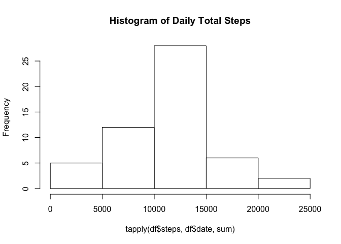
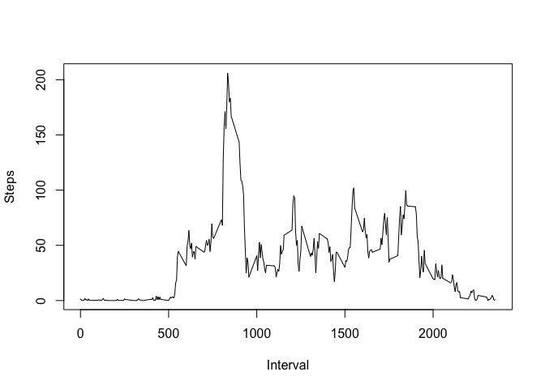
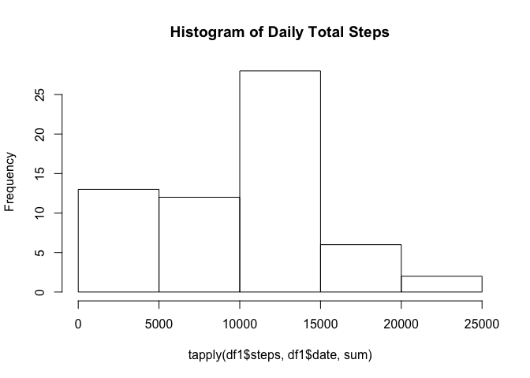
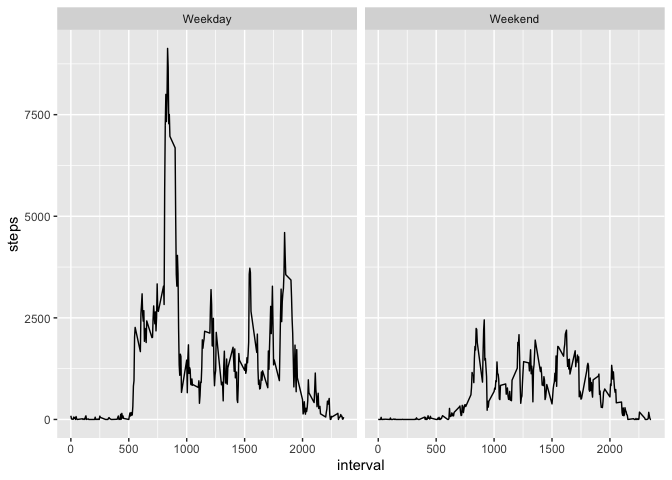

## 1. Loading Data into R


```r
unzip("activity.zip")
df <- read.csv("activity.csv")
str(df)
```

```
## 'data.frame':	17568 obs. of  3 variables:
##  $ steps   : int  NA NA NA NA NA NA NA NA NA NA ...
##  $ date    : Factor w/ 61 levels "2012-10-01","2012-10-02",..: 1 1 1 1 1 1 1 1 1 1 ...
##  $ interval: int  0 5 10 15 20 25 30 35 40 45 ...
```

## 2. What is mean total number of steps taken per day?
### 2.1 Calculating average steps per day (ave_step)

```r
ave_step <- tapply(df$steps, df$date, mean)
```
### 2.2 Make a histogram of the total number of steps taken each day (p1)

```r
p1 <- hist(tapply(df$steps, df$date, sum), main = "Histogram of Daily Total Steps")
```

<!-- -->
### 2.3 Calculate and report the mean and median of the total number of steps taken per day
mean

```r
mean(ave_step, na.rm = TRUE)
```

```
## [1] 37.3826
```
median

```r
median(ave_step, na.rm = TRUE)
```

```
## [1] 37.37847
```

## 3. What is the average daily activity pattern?
### 3.1 Make a time series plot (i.e. type="l") of the 5-minute interval (x-axis) and the average number of steps taken, averaged across all days (y-axis)

```r
ave_step_by_interval <- tapply(df$steps, df$interval, mean, na.rm = TRUE)
p2 <- plot(row.names(ave_step_by_interval), ave_step_by_interval, type = "l", xlab = "Interval", ylab = "Steps")
```

<!-- -->

```r
print(p2)
```

```
## NULL
```

### 3.2 Which 5-minute interval, on average across all the days in the dataset, contains the maximum number of steps?

```r
names(which.max(ave_step_by_interval))
```

```
## [1] "835"
```

## 4. Imputing missing values

### 4.1 Calculate and report the total number of missing values in the dataset (i.e. the total number of rows with  NA


```r
total_nas <- sum(is.na(df$steps))
```
### 4.2 Devise a strategy for filling in all of the missing values in the dataset. The strategy does not need to be sophisticated. For example, you could use the mean/median for that day, or the mean for that 5-minute interval, etc. Then create a new df

Strategy: replacing by mean or 0 when mean of daily steps is NA

```r
df1 <- df
ave_step_tab <- data.frame(date = unique(df$date), mean = tapply(df$steps, df$date, mean, rm.na = TRUE))
ave_step_tab$mean[is.na(ave_step_tab$mean)] <- 0

for (i in 1:nrow(df)) {
  if(is.na(df1$steps [i]) == TRUE) {
    df1$steps[i] <- ave_step_tab$mean[which(ave_step_tab$date == df1$date[i])]
  }
}
```
### 4.3 Make a histogram of the total number of steps taken each day and Calculate and report the mean and median total number of steps taken per day. Do these values differ from the estimates from the first part of the assignment? What is the impact of imputing missing data on the estimates of the total daily number of steps?

The Histogram of Daily Total Steps with NA values replaced

```r
p3 <- hist(tapply(df1$steps, df1$date, sum), main = "Histogram of Daily Total Steps")
```

<!-- -->

```r
p3
```

```
## $breaks
## [1]     0  5000 10000 15000 20000 25000
## 
## $counts
## [1] 13 12 28  6  2
## 
## $density
## [1] 4.262295e-05 3.934426e-05 9.180328e-05 1.967213e-05 6.557377e-06
## 
## $mids
## [1]  2500  7500 12500 17500 22500
## 
## $xname
## [1] "tapply(df1$steps, df1$date, sum)"
## 
## $equidist
## [1] TRUE
## 
## attr(,"class")
## [1] "histogram"
```
Mean of Daily Steps

```r
ave_step1 <- tapply(df1$steps, df1$date, mean)
mean(ave_step1)
```

```
## [1] 32.47996
```
Median of Daily Steps

```r
median(ave_step1)
```

```
## [1] 36.09375
```

## 5. Are there differences in activity patterns between weekdays and weekends?

```r
day_list <- cbind(c(rep("Weekday", 5), rep("Weekend", 2)), c("Monday", "Tuesday", "Wednesday", "Thursday", "Friday", "Saturday", "Sunday"))
df2 <- merge(data.frame(df1, Weekdays = weekdays(as.POSIXct(df1$date))), day_list, by.x = "Weekdays", by.y = "V2")

library(ggplot2)
p4 <- ggplot(data = df2, aes(x = interval, y = steps)) +
  stat_summary(fun.y = sum, geom = "line") +
  facet_wrap(~V1)
p4
```

<!-- -->

